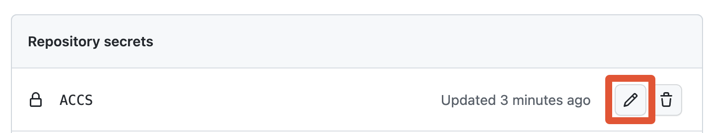
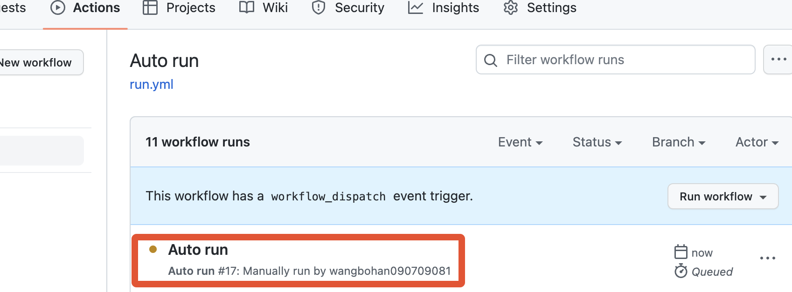

# 使用Github为你的天翼云盘每日签到

## 前言

大家好，今天为大家带来一期使用Github为你的天翼云盘每日签到，那么我们首先因准备这些东西

- 一台电脑（或手机设置成电脑UA）
- 一个Github账号
- 天翼云盘的账号和密码

如果你的Github访问过慢，请尝试使用加速器，我这里推荐[Watt Toolkit（原steam++）](https://steampp.net/)

## 准备好了吗，那开始吧

1. 确保您的Github可以正常访问，如果你使用了Watt Toolkit加速器，请务必将加速期更改为Host代理模式，如果您使用的是Macos系统，且也使用Watt Toolkit加速器，请在Finder界面按下组合键⌘⇧G或在Finder的顶栏的前往菜单中的前往文件夹二级菜单，如图
   

2. Fork自动签到的仓库，我的或原作者的
   [原作者链接](https://github.com/xtyuns/cloud189app-action)  [我的链接](https://github.com/wangbohan090709081/cloud189app-action)
   

3. 找到您Fork的仓库，可以点击您的头像，再点击您的用户名查看您的所有仓库，然后访问此仓库，如果您已有多个仓库，请找打刚刚fork的仓库

4. 

5. 点击Setting按钮，进入设置页面，然后在左侧找到菜单Security- secrets- Actions 

6. 

7. 点击New repository secrets新建一个变量
   

8. 在新的页面的Name和Secret输入框输入ACCS，然后点击Add secret

9. 在Repository secrets下找到您刚刚创建好的变量，然后点击笔编辑
   

10. 在Value输入您的账号信息，格式:手机号----密码，例如

    > 11451419198----homohomo

11. 然后点击Update secret
    

12. 我们点击Star给它标记上，使它能够自动运行
    

13. 我们切换到Actions选项卡，然后点击 I understand my workflows, go ahead and enable them启用Actions
    

14. 至此，您已设置完成，我们运行试试，在Actions选项卡中点击左侧的Auto run

    

15. 点击Run workflow按钮，然后在弹出的菜单再次点击
    

16. 刷新浏览器，然后点击刚刚建立的任务
    

17. 点击左侧的Jobs下的run，在点击右侧的执行任务，显示如下，说明成功执行


## 启用消息推送(来自原作者)

目前支持推送的平台:
> 可同时启用多个平台的推送功能
- [钉钉群组机器人](#配置钉钉群组机器人消息推送)
- [PushPlus](#配置-pushplus-消息推送)

### 配置钉钉群组机器人消息推送

1. 使用钉钉 PC 端打开目标群, 或新建一个群组
2. 在该群中打开设置 `智能群助手->添加机器人->自定义机器人`
3. 安全设置选择 `加签`, 并复制出签名秘钥
4. 打开 Github 设置参数 ([参照教程](deploy.md#二设置账号密码))
    ```text
    Name: DINGTALK_SECRET
    Value: 上一步所复制的值
    ```
5. 点击完成, 并设置 `DINGTALK_WEBHOOK` 参数
    ```text
        Name: DINGTALK_WEBHOOK
        Value: 客户端所示的值
    ```
6. 钉钉群组机器人推送消息配置完成

### 配置 PushPlus 消息推送

1. 打开 [PushPlus 官网](http://pushplus.plus/)

2. 使用微信扫码登录, 并复制 token

3. 打开 Github 设置参数 ([参照教程](deploy.md#二设置账号密码))
    ```text
    Name: PUSHPLUS_TOKEN
    Value: 上一步所复制的值
    ```

4. PushPlus 推送消息配置完成

    
